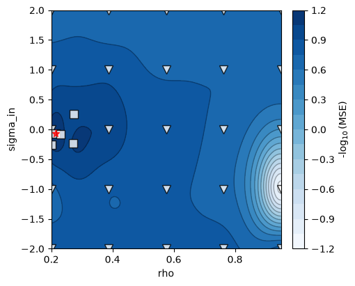
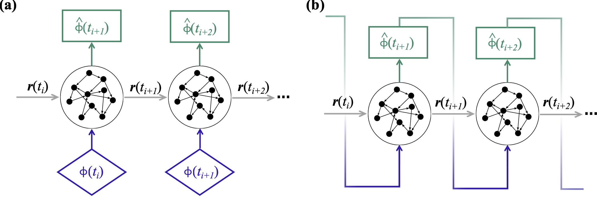

# Training and forecasting

One `EchoStateNetwork` holds three matrices: a fixed random input matrix
$\mathbf{W}_\mathrm{in}$, a fixed random reservoir matrix $\mathbf{W}$
(sparse, rescaled to unit spectral radius when generated), and the trained
readout $\mathbf{W}_\mathrm{out}$ — the only matrix that learning touches.

## The model

One `step(u, r)` advances the reservoir open loop and reads out the physical
state:

$$
\mathbf{r}_{n+1} = (1-\alpha)\,\mathbf{r}_n + \alpha \tanh\!\big(
\sigma_\mathrm{in} \mathbf{W}_\mathrm{in} [\tilde{\mathbf{u}}_n;\, b_\mathrm{in}]
+ \rho\, \mathbf{W} \mathbf{r}_n \big), \qquad
\mathbf{u}_{n+1} = \mathbf{W}_\mathrm{out}^\top [\mathbf{r}_{n+1};\, b_\mathrm{out}]
$$

where $\tilde{\mathbf{u}} = (\mathbf{u} - \texttt{shift}) / \texttt{norm}$ is
the shift-and-scale normalized input (set from the training data range by
default), $b_\mathrm{in}, b_\mathrm{out}$ are symmetry-breaking biases, and
$\alpha$ = `leak_rate` (the default $\alpha = 1$ is the plain tanh update; see
the [leaky-ESN tutorial](https://github.com/andreanovoa/EchoStateNetwork/blob/master/tutorials/03_leaky_esn.ipynb)).
The hyperparameters that matter are the effective spectral radius `rho`, the
input scaling `sigma_in`, and the Tikhonov regularization `tikh` — all three
selected by validation (below).


*The two configurations of the network (diagram from
[romda](https://github.com/andreanovoa/romda), where the ESN forecasts a bias
$\mathbf{b}$ — read $\mathbf{b}$ as this package's physical state
$\mathbf{u}$). (a) Training: teacher-forced open loop on data pairs; the
readouts $\mathbf{b}^\mathrm{tr}_{k+1}$ against their targets form the ridge
regression for $\mathbf{W}_\mathrm{out}$. (b) Forecasting: closed loop — each
prediction $\mathbf{b}^\mathrm{f}$ feeds back as the next input (in romda the
first input is the innovation $\mathbf{d}_k - \mathbf{M}\bar{\psi}^a_k$; here,
the last washout readout).*

For a *parametric* ESN, `input_parameters` appends parameter columns to the
input, densely connected through $\mathbf{W}_\mathrm{in}$ — one reservoir
conditioned on a physical parameter
([tutorial 02](https://github.com/andreanovoa/EchoStateNetwork/blob/master/tutorials/02_parametric_esn.ipynb)).
With partial observability, `observed_idx` selects which components of the
full state are fed back as inputs.

## Training

`train(train_data)` accepts a single trajectory `(Nt, N_dim)`, a batch of
segments `(L, Nt, N_dim)`, or a ragged list of segments of different lengths,
and runs four steps:

1. **Split** the data into washout (`N_wash` steps, inside `t_train`),
   training + validation (`t_train`, `t_val` — inferred from the data when
   omitted), and an optional held-out test tail (`t_test`). Gaussian noise
   (`noise`) is added to the training *inputs* only — targets stay clean — as
   regularization.
2. **Generate** $\mathbf{W}_\mathrm{in}$ and $\mathbf{W}$ from `seed`, if not
   already set.
3. **Select hyperparameters** by Bayesian optimization over
   `hyperparameters_to_optimize` (skip by passing `[]`), scoring each
   candidate with a [validation strategy](validation.md) — closed-loop error
   on folds carved from the training series. The search trace is kept in
   `bo_results`.

    

    *Validation-error landscape over `(rho, sigma_in)` from
    [tutorial 01](https://github.com/andreanovoa/EchoStateNetwork/blob/master/tutorials/01_echo_state_network.ipynb):
    markers are the evaluated points (initial grid + gp-hedge acquisitions),
    the star the selected optimum. `plot_training=True` produces this figure.*
4. **Solve** the ridge regression for $\mathbf{W}_\mathrm{out}$ on the full
   train + validation data with the selected `tikh`.

`training_summary()` prints the realized split, folds, and selected
hyperparameters of the last call.

### Seeded ensembles

The reservoir is a random draw, so `train(n_seeds=m)` trains `m` realizations
(seeds `base, base+1, ...`) in parallel processes, keeps the network with the
best validation score in place, and stores every score in `seed_scores` —
selection by validation score consistently lands in the ensemble's best half
on test error (see the
[validation strategies](validation.md#ensembles-of-reservoir-seeds) page).

## Forecasting

The ESN runs in two modes:



*(a) open loop: the reservoir is driven by data $\phi(t_i)$ and its readouts
$\hat{\phi}(t_{i+1})$ are one-step-ahead predictions; (b) closed loop: each
prediction is fed back as the next input and the network runs autonomously.*

- **Open loop** (teacher forcing): `step()` is fed observed data; used for
  training and for *washout* — driving the reservoir from
  $\mathbf{r}_0 = \mathbf{0}$ through a short window of true history so it
  synchronizes with the physical state before a forecast.
- **Closed loop**: each prediction is fed back as the next input
  (`outputs_to_inputs` selects the observed components and re-appends the
  parameter columns); the model runs autonomously.

```python
r = np.zeros((esn.N_units, 1))
u = np.zeros((esn.N_dim, 1))
for u_in in wash:                      # open-loop washout on true history
    u, r = esn.step(u_in[:, None], r)

forecast = []
for _ in range(n_steps):               # closed-loop forecast
    u, r = esn.step(esn.outputs_to_inputs(u), r)
    forecast.append(u[:, 0])
```

Alignment: the washout's last output is the one-step-ahead prediction of the
frame *after* `wash`, so closed-loop prediction `i` corresponds to data row
`len(wash) + 1 + i`.

`run_test()` packages this — open-loop washout, closed-loop forecast, error
against truth — over the held-out test tail, with plots. For a fair error
metric across components use `compute_nMAE(Y_true, Y_pred, norm=...)`, the
range-normalized mean absolute error used throughout training and validation.

See the
[EchoStateNetwork tutorial](https://github.com/andreanovoa/EchoStateNetwork/blob/master/tutorials/01_echo_state_network.ipynb)
for the full workflow on Lorenz 63, and the
[API reference](api/esn.md) for every attribute and method.
