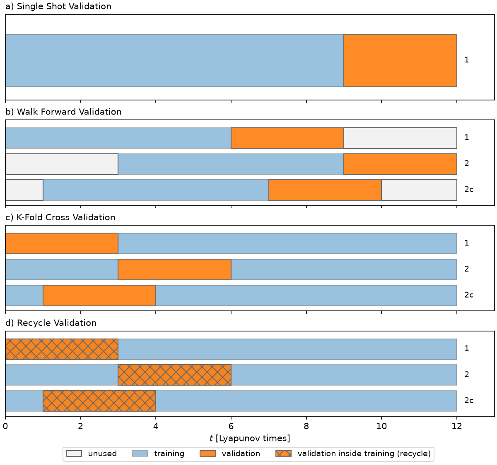

# Validation strategies

Hyperparameter selection in [`train()`](api/esn.md) minimizes a validation
objective by Bayesian optimization. The objective is pluggable: any function in
`echostatenetwork.validation` can be passed as
`train(validation_strategy=...)`. They differ in how the wash-train-validation
series is folded into training and validation intervals — everything else
(closed-loop scoring, the Tikhonov grid, the optimizer bookkeeping) is shared.

*Fold geometry on a 12-Lyapunov-time series, redrawn after Fig. 2 of Racca &
Magri (2021). Rows 1 and 2 are successive folds of the regular version; row 2c
is the chaotic variant, which advances folds by about one Lyapunov time instead
of the interval length so the intervals overlap and the fold count multiplies
(set `val_fold_step`). Hatched = validation intervals recycled from inside the
training data.*

## Choosing a strategy

- **`RVC_Noise`** (the default) — *chaotic recycle validation*. `Wout` is
  trained once on all the data; each fold only re-washes the reservoir and
  scores a closed-loop run on an interval recycled from the training series.
  Racca & Magri (2021) find it matches K-fold's accuracy at a fraction of the
  cost, since there is no per-fold retraining.
- **`SSV`** — *single shot validation*: one training/validation split. The
  cheapest and, for chaotic series, the least reliable — its single interval
  correlates weakly with test error. Provided for comparison.
- **`WFV`** — *walk forward validation*: a fixed training window slides
  forward, validating on the interval just after it; each fold retrains `Wout`
  on its own window (pure arithmetic on prefix ridge sums — the teacher-forced
  reservoir pass is shared).
- **`KFV`** — *K-fold validation*: leave-one-interval-out; each fold retrains
  on everything outside its validation interval, exactly (prefix-sum
  assembly), and validates on it.

All strategies select the Tikhonov parameter from `tikh_range` per evaluation
and score their probes through a shared **validation metric**: any callable
`metric(case, Y_true, Y_pred, norm) -> float` (divergence penalty included).
Set `validation_metric` on the ESN to swap the scoring for every strategy at
once; built-ins are `log_nMAE` (log10 range-normalized MAE, the recycle-family
default) and `nMSE` (raw variance-normalized MSE). The qlESN-specific segment
strategies (`SegmentRVC_Noise`, `RecycledSegmentRVC_Noise`) live in
[qlrom](https://github.com/andreanovoa/qlrom)'s
`qlroms.data_driven_qlroms.validation` and share the same contract.

## Ensembles of reservoir seeds

The reservoir matrices are random draws, so validation quality is an ensemble
statement. `train(n_seeds=m)` trains `m` realizations in parallel, keeps the
one with the best validation score, and stores all scores in `seed_scores`.
[`scripts/compare_validation_strategies.py`](https://github.com/andreanovoa/EchoStateNetwork/blob/master/scripts/compare_validation_strategies.py)
reproduces the paper's Table-1/Figure-8 protocol at reduced scale and evaluates
that selection rule: the kept member consistently lands in the ensemble's best
half on test error, usually the best quarter.

See the
[validation strategies tutorial](https://github.com/andreanovoa/EchoStateNetwork/blob/master/tutorials/04_validation_strategies.ipynb)
for a live comparison on Lorenz 63.

## Reference

Racca & Magri (2021). Robust optimization and validation of echo state
networks for learning chaotic dynamics. *Neural Networks*, 142, 252-268
([arXiv:2103.03174](https://arxiv.org/abs/2103.03174)).

## API

::: echostatenetwork.validation
